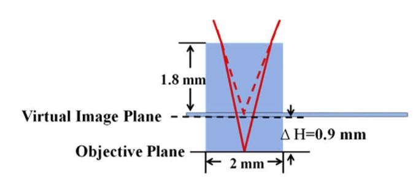

# Multi-planar macroscope
##本项目实现一台同时观测小鼠脑皮层和深层海马区的宽视场显微镜，分辨率能够达到单细胞，视场达到6毫米，基本覆盖小鼠脑皮层中心。
- 基本光路图如下
- 
- 深层成像原理如下图所示
- 

# 材料列表
- 体视镜头（奥林巴斯宏观变倍镜头2X和1X）
- 473 nm激光器（488 nm更好，功率200 mW）
- 反射棱镜（边长 2 mm）
- 针（用于固定棱镜）
- 三维平移台（大恒光电）\*2
- 俯仰调节台（大恒光电）\*2
- sCMOS（Andor或者滨松）
- 
# 光学系统搭建关键
1. 固定两个镜头位置。两个镜头的螺距为M65\*1.5，可直接金属加工实现。
2. 棱镜用于反射入射激光。激光经过扩束后焦点在反射棱镜附近。反射棱镜的边长不宜过大，尽可能减小对光路的遮挡。位置应该尽可能靠近2X镜头。棱镜用针悬挂以减小遮挡。三维位移台和俯仰台用于调节棱镜的位置和角度。
3. 另一组三维位移台和俯仰台用于固定小鼠的位置与姿态。
4. scmos相机固定于1X镜头上方，距离可以用平行光入射的焦点估计。
5. 激光入射光路，经过扩束后聚焦到反射棱镜即可。注意聚焦透镜的焦距要足够大，至少大于40mm 从而保证聚焦到棱镜所在的物镜中央位置。

# 海马区光学窗口搭建流程
1. 搭建吸取设备。用真空泵连接平头针管（京东）
2. 开颅手术，流程见参考文献
3. 吸取海马上层脑组织深度约1mm，直到看到海马区纹理
4. 装入消毒后的玻璃柱，后加盖盖玻片。玻璃柱与玻璃片之间可用紫外胶粘连防止组织生长。
5. 密封玻璃片，装上固定头件，两周后成像观测。

# 参考文献

- Chaowei Zhuang, Jiangbei Cao, Rujin Zhang, Guihua Xiao, Jing Hu, Hao Xie, and Qionghai Dai, "Real-time brain-wide multi-planar microscopy for simultaneous cortex and hippocampus imaging at the cellular resolution in mice," Biomed. Opt. Express 12, 1858-1868 (2021)
- C. Zhuang, R. Zhang, G. Xiao, J. Cao, H. Xie, and Q. Dai, "Simultaneous superficial cortex and deep brain imaging in mice brain using wide-field microscope through implanting custom-built cranial window," in OSA Imaging and Applied Optics Congress 2021 (3D, COSI, DH, ISA, pcAOP), H. Hua, B. Javidi, M. Martinez-Corral, O. Matoba, A. Stern, S. Thibault, T. Alieva, J. Ke, F. Willomitzer, F. Okten, P. Silveira, P. Banerjee, E. Stoykova, D. Chu, J. Park, F. Imai, C. Joo, M. Digman, D. Gardner, S. Gladysz, D. LeMaster, S. Basu, and O. Korotkova, eds., OSA Technical Digest (Optica Publishing Group, 2021), paper ITu7A.7.

